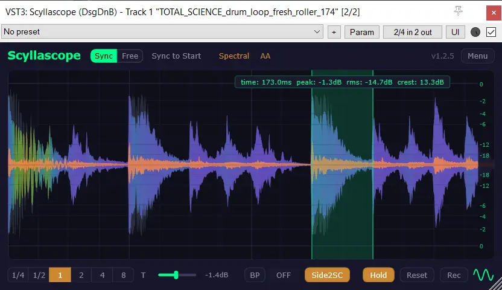

# Scyllascope Docs

Documentation for **Scyllascope** — a free, cross-platform oscilloscope plugin (VST3, AU, LV2) with built-in recorder, spectral view, sidechain overlay, and more.

## Links

- [Documentation](https://sakhnovkrg.github.io/Scyllascope-Docs/) — full manual on GitHub Pages
- [Download](https://dsgdnb.com/plugins/scyllascope) — get the plugin
- [Donate](https://dsgdnb.com/donate) — support the developer

## Contributing

Found a typo or want to improve the docs? PRs are welcome — every page has a "Help to improve" link at the bottom.
